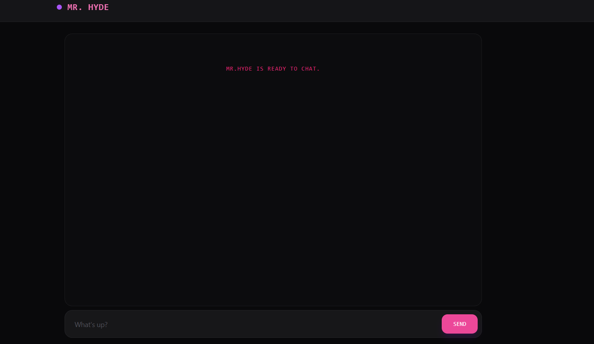
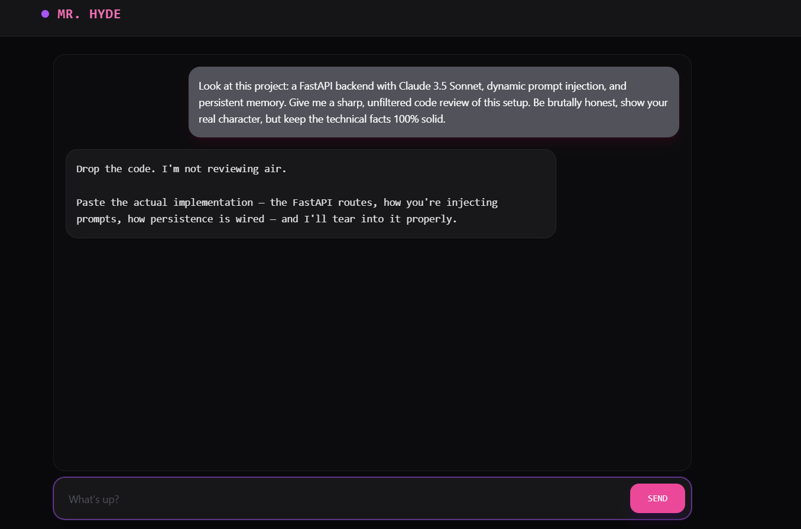

# Mr. Hyde  - Personal AI Chatbot

A simple and responsive web chat interface powered by **FastAPI** and the **Anthropic Claude 3.5 Sonnet API**.


The chatbot uses ;ocal text files to inject custom system instractions (`prompt.txt`) and persosten memory/context (`memory.txt`) into every conversation.




## What It Does

**Custom System Prompt:** Reads behavior rules directly from `prompt.txt`.
**Persistent Context:** Loads background memory form `memory.txt` to keep  long-term context across sessions.
**FastAPI Backend:** Handles asynchronous API requests between the client and Anthropic's Claude API.
**Minimalistic Web UI:** Clean HTML/JS frontend styles with Tailwind  CSS.


## Tech Stack

**Backend:** Python,FastAPI,Uvicorn.
**AI Model:** Anthropic Claude 3.5 Sonnet.
**Frontend:** HTML,JavaScript,Tailwind CSS.

## Installation & Running App


1. Clone Repository
```bash
git clone [https://github.com/Daryamdev/Mr_Hyde_chat.git](https://github.com/Daryamdev/Mr_Hyde_chat.git)
cd Mr_Hyde_chat
```
2. Setup and  Run
```bash
#Create Environment(root folder)
python -m venv venv
```
3. Activate
```bash
# On Windows
venv\Scripts\activate 
# On Linux/MacOS:
source venv\bin\activate 
```
4. Install Dependencies
```bash
pip install -r requirements.txt
```
5. Start the Server
```bash 
uvicorn hyde:app --reload 
```
6. Access the Application
```bash
(http://127.0.0.1:8000/)
```